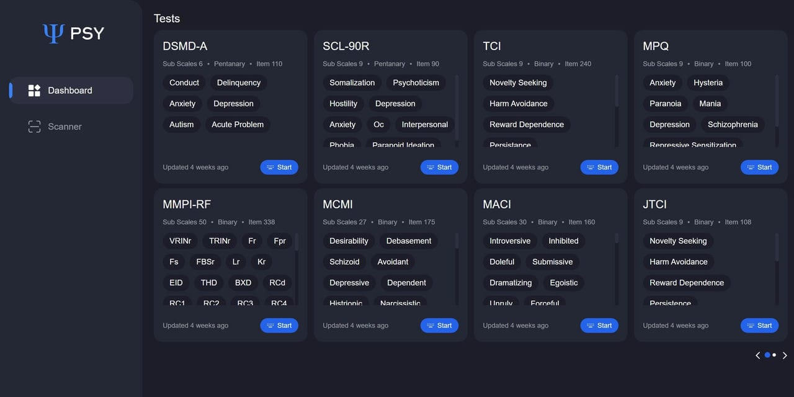

# Psy
A psychoanalytical calculator for various assessments and a scanner for automatic analysis

# Scales
| Scale   | Created | Tested | Published |
|---------|---------|--------|-----------|
| EPQ     |   ✓     |   ✓    |     ✓     |
| EPQ-R   |   ✓     |   ✓    |     ✓     |
| JTCI    |   ✓     |   ✓    |     ✓     |
| MACI    |   ✓     |   ✓    |     ✓     |
| MCMI    |   ✓     |   ✓    |     ✓     |
| MMPI-RF |   ✓     |   ✓    |     ✓     |
| MPQ     |   ✓     |   ✓    |     ✓     |
| TCI     |   ✓     |   ✓    |     ✓     |
| SCL-90R |   ✓     |   ✓    |     ✓     |
| DSMD-A  |   ✓     |   ✓    |     ✓     |
| DSMD-C  |   ✓     |   ✓    |     ✓     |
| JEPQ    |   -     |   -    |     -     |
| LEYTON  |   -     |   -    |     -     |
| BAI     |   -     |   -    |     -     |

## Todos
---
- Add responsiveness
- Add a Landing Page
- Trigger A Feedback form after every scan and calculation
- Using anonymous login mechanisms to create user
- Create login model and let anonymous user convert to loggedin user
- Include the fullform of every scale
- Add Error/Warning Toast
- Improve Feedback Form
- Upload documents to firestore
- Deploy Psy-OMR to VPS
- Add Beck Anxiety Inventory

## Keywords
- psychology tool - 3,600
- beck anxiety inventory scoring - 720
- free psychological assessment tools list - 210
- beck anxiety inventory scoring interpretation - 170
- psyc tools - 140
- psychotherapy tools - 70
- psychological measurement tools - 50